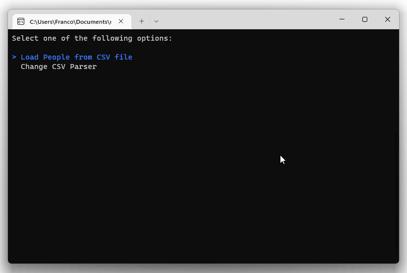
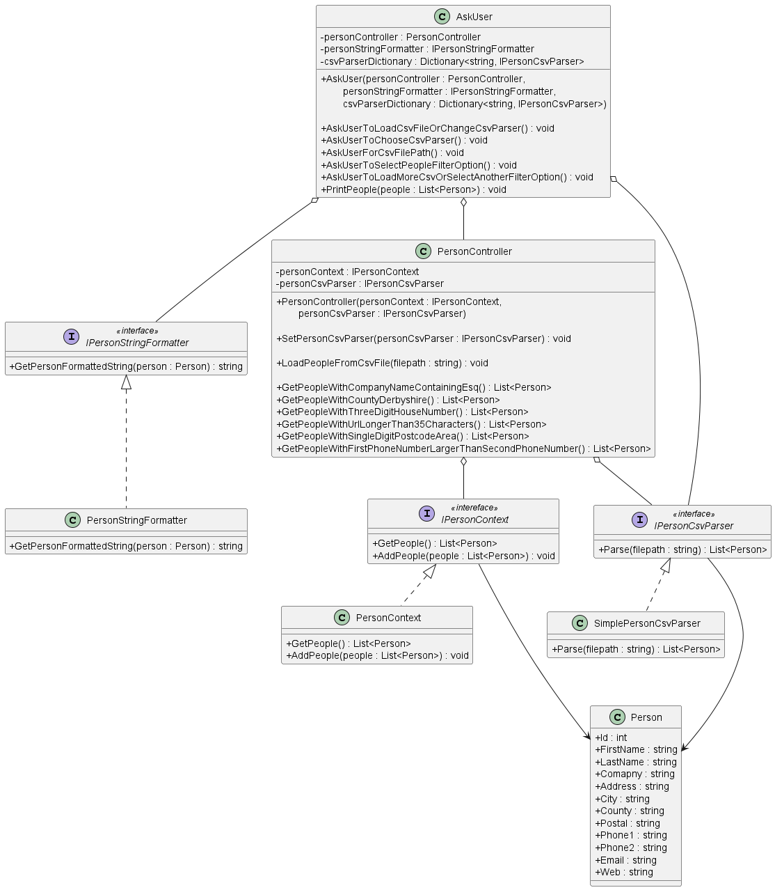

# Mars Rover Challenge

This repository contains a C# console application that allows user to read data of people from a CSV file (for example `input.csv`), and then print a "filtered" list of people on the following filtering options:

1. Every person who has “Esq” in their company name.
2. Every person who lives in “Derbyshire”.
3. Every person whose house number is exactly three digits.
4. Every person whose website URL is longer than 35 characters.
5. Every person who lives in a postcode area with a single-digit value.
6. Every person whose first phone number is numerically larger than their second phone number.

Here we have 3 folders:

1. The `PersonApp` folder contains the C# solution to the challenge
2. The `PersonApp.Tests` folder contains the unit tests for the solution
3. The `diagrams` folder contains diagrams related to the solution

# Instructions

**Prerequisite**: The machine running the application should have [.NET 6.0](https://dotnet.microsoft.com/en-us/download/dotnet/6.0) (or above) installed.

To run the application:

1. clone the repository to your computer
2. then navigate to the `PersonApp` folder (with `cd` command or otherwise)
3. then run the following command

```c#
dotnet run
```

# Demo



When the console app runs, it'll first ask you to select whether you want to do:

```
Select one of the following options:

> Load People from CSV file
  Change CSV Parser
```

Use `[Up Arrow]`, `[Down Arrow]`, and `[Enter]` keys on the keyboard to select.

Choosing the `Load People from CSV file` option allows you to specify the full path to the CSV file that you want to load:

```
Load People from CSV file
Enter .csv file path to load (full path): C:\Users\Franco\Downloads\input.csv
```

For example, here we're loading the `input.csv` file located in `C:\Users\Franco\Downloads\input.csv`.

Then a selection menu appears for you to select the filtering options:

```
.csv file loaded.

Select one of the filtering options below:

  Get people with company name that has "Esq"
> Get people who lives in "Derbyshire"
  Get people with three digit house number
  Get people with URL longer than 35 characters
  Get people with single digit postcode area code
  Get people with first phone number larger than second phone number
```

After selecting a filtering option, the console app will print the filtered list of people onto screen:

```
Get people who lives in "Derbyshire"

Count: 10

10 - Yuette Klapec - Max Video
12 - Charlesetta Erm - Cain, John M Esq
49 - Pedro Aschoff - Charlotte Chamber
88 - Jeannetta Coolidge - Tiny Tots Originals Div
142 - Allene Burau - Allied Plastics
174 - Freida Newyear - Flash, Elena Salerno Esq
214 - Edwin Logghe - Joseph Victor & Son Inc
303 - Almeta Keehner - Hoolahan, Catherine G Esq
482 - Ahmad Alsaqri - Alliance Construction Co Inc
486 - Zachary Freeburger - Country Kitchen
```

where each person is printed in the format of:

```
position in full list - full name - company name
```

# UML Diagram

Here's the UML class diagram for this application.



# Extensibility

If the user wants to use a 3rd party CSV parser to parse the CSV file instead of using the default CSV parser of this application, then they'll need to create **a new class** that implements the `IPersonCsvParser` interface.

And in that **new class**, implement the `.Parse` method to use their desired CSV parser implementation.


For example above, we could use the **adapter** design pattern so that the new class (`ThirdPartyCsvParserAdapter`) implements from the `IPersonCsvParser` and uses the 3rd party CSV parser to parser the file.
